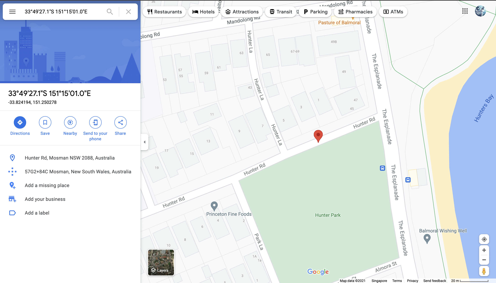
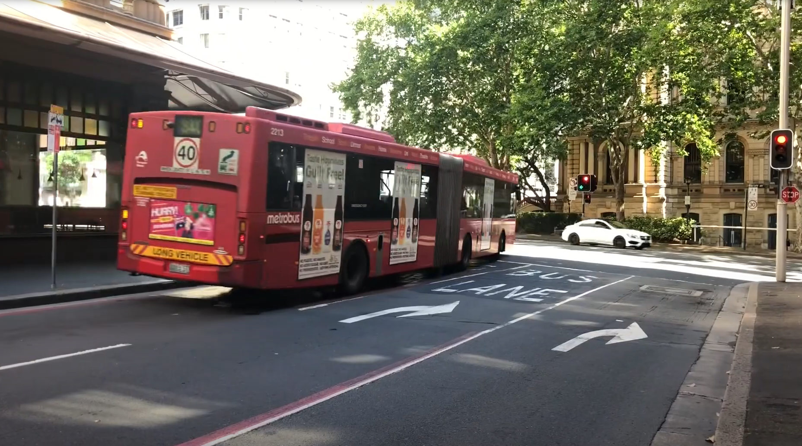
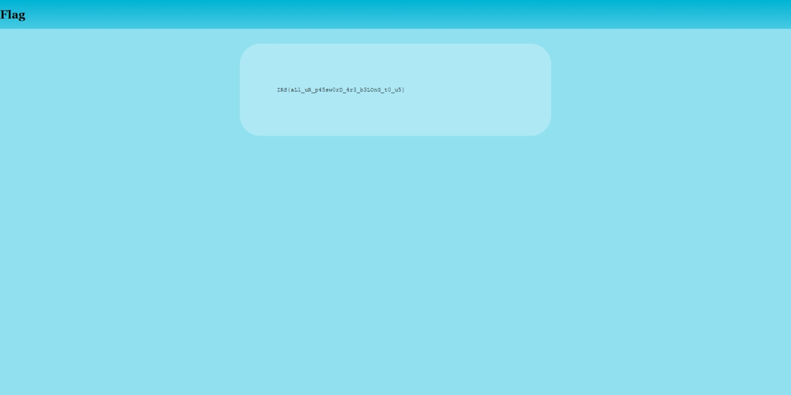

# Sieberrsec CTF 3.0 Writeup

By *spareus* comprising Liu Jie Xu ([@8061xjl](https://github.com/8061xjl)) and Liu Weichu ([@dabby9734](https://github.com/dabby9734))

**🚧 WRITEUPS ARE INCOMPLETE AND STILL WORK IN PROGRESS 🚧**

Archive of CTF challenges can be found [here](https://github.com/8061xjl/ctfarchive-sctf-3.0) (my *manually* archived version lol) or [here](https://github.com/IRS-Cybersec/Sieberrsec-CTF-3.0) (official).

*Writeups are limited.*

---

[PWN](#pwn)

- [ ] [simple](#simple)
- [ ] [warmup](#warmup)
- [ ] [malloc](#malloc)
- [x] [rock farm simulator 2011](#rock-farm-simulator-2011)
- [ ] [Turbo Fast Crypto, part 2](#turbo-fast-crypto-part-2)

[CRYPTO](#crypto)

- [x] [Shalom Shalom](#shalom-shalom)
- [ ] [Turbo Fast Crypto, part 1](#turbo-fast-crypto-part-1)
- [ ] [I can't open this file? Part 2](#i-cant-open-this-file-part-2)
- [x] [Diffie's Key Exchange](#diffies-key-exchange)
- [x] [I can't open this file? Part 1](#i-cant-open-this-file-part-1)
- [ ] [totallyfoolproofcrypto](#totallyfoolproofcrypto)
- [ ] [Diffie's Key Exchange 2](#diffies-key-exchange-2)
- [ ] [whodunnit](#whodunnit)

[RE](#re)

- [x] [Flag checker](#flag-checker)
- [x] [Reverse](#reverse)
- [ ] [Flag checker v2.0](#flag-checker-v20)

[OSINT](#osint)

- [x] ["The Sieberr" Heist Part 1](#the-sieberr-heist-part-1)
- [ ] [A Wealth of Information Part 1](#a-wealth-of-information-part-1)
- [ ] [We go way back](#we-go-way-back)
- [ ] [A Wealth of Information Part 2](#a-wealth-of-information-part-2)
- [x] ["The Sieberr" Heist Part 3](#the-sieberr-heist-part-3)
- [x] ["The Sieberr" Heist Part 2](#the-sieberr-heist-part-2)
- [ ] [Public Transport Hunt](#public-transport-hunt)

[WEB](#web)

- [ ] [[Part 1] FUTURE TECHNOLOGIES AI IOT FOURTH INDUSTRIAL REVOLUTION SECURITY CAMERA](#part-1-future-technologies-ai-iot-fourth-industrial-revolution-security-camera)
- [ ] [[Part 2] FUTURE TECHNOLOGIES AI IOT FOURTH INDUSTRIAL REVOLUTION SECURITY CAMERA](#part-2-future-technologies-ai-iot-fourth-industrial-revolution-security-camera)
- [ ] [TaiYang IT Solution Part 1](#taiyang-it-solution-part-1)
- [ ] [Exploring The Universe! (Part 1)](#exploring-the-universe-part-1)
- [ ] [TaiYang IT Solution Part 2: Electric Boogaloo](#taiyang-it-solution-part-2-electric-boogaloo)

[FORENSICS](#forensics)

- [x] [Duck Delivery](#duck-delivery)
- [x] [Birds?](#birds)
- [x] [Digging In The Dump Pt. I](#digging-in-the-dump-pt-i)
- [x] [Digging In The Dump Pt. II](#digging-in-the-dump-pt-ii)
- [ ] [Mind Cracking Adversity](#mind-cracking-adversity)
- [ ] [Exploring The Universe! (Part 2)](#exploring-the-universe-part-2)
- [ ] [plush, lush, flush, blush](#plush-lush-flush-blush)

[MISC](#misc)

- [ ] [Heads and Tails Part 1](#heads-and-tails-part-1)
- [ ] [Heads and Tails Part 2](#heads-and-tails-part-2)
- [ ] [Heads and Tails Part 3](#heads-and-tails-part-3)
- [ ] [Can You Math It?](#can-you-math-it)
- [x] [I lost my anime collection! Pt. II](#i-lost-my-anime-collection-pt-ii)
- [ ] [I lost my anime collection! Pt. I](#i-lost-my-anime-collection-pt-i)
- [ ] [rock farming simulator deluxe edition](#rock-farming-simulator-deluxe-edition)

[SANITY](#sanity)

- [ ] [sanity check](#sanity-check)

---

## PWN

### rock farm simulator 2011

[Challenge](https://github.com/8061xjl/ctfarchive-sctf-3.0#rock-farm-simulator-2011)

*We did not solve this challenge during the competition.*

Summary of how this works:


*This is not a complete writeup, just an extension of what I had to do to get it to work.*

Working examples from challenge author *main*:

https://user-images.githubusercontent.com/44281062/147614438-253b789f-aea1-470b-9e2a-df09a5fa129c.mov

[](https://asciinema.org/a/MQ9MRRVn1jxJO3SeBCRJTU8rj)

The solution is to quickly buy 2 ponies during the delay. However, it was incredibly difficult for me to get that to work (perhaps I'm just too slow lol), so I wrote a small [AHK](https://www.autohotkey.com/) script to send the keys I need, hoping it would be faster:

```
#NoEnv  ; Recommended for performance and compatibility with future AutoHotkey releases.
; #Warn  ; Enable warnings to assist with detecting common errors.
SendMode Input  ; Recommended for new scripts due to its superior speed and reliability.
SetWorkingDir %A_ScriptDir%  ; Ensures a consistent starting directory.

KeyWait, LAlt, D
KeyWait, LAlt, L
Send b
Send t
Send b
Send b
Send p
Send h
Send h
```

It worked. scripts > humans

## CRYPTO

### Shalom Shalom

[Challenge](https://github.com/8061xjl/ctfarchive-sctf-3.0#shalom-shalom)

This challenge provided us with a string to decrypt (`xibkgltizksbrhxllo`). The words **AT** and **BASH** were capitalised in the challenge description, indicating a clue.

*Intended solution was to decipher the string with the [Atbash](https://en.wikipedia.org/wiki/Atbash) cipher that the clues were referring to. By [deciphering](https://www.dcode.fr/atbash-cipher) it, we get the flag `cryptographyiscool`*

We ran the string through a [cipher identifier](https://www.dcode.fr/cipher-identifier) to find out what cipher was used.


We get the flag by deciphering the string with [Affine Cipher](https://www.dcode.fr/affine-cipher) in bruteforce mode. It is interesting to note that the Atbash cipher is just an Affine cipher with a fixed key 🙂.

### Diffie's Key Exchange

[Challenge](https://github.com/8061xjl/ctfarchive-sctf-3.0#diffies-key-exchange)

After staring at the challenge for a while, we discover that understanding math is important. We notice if `priv-key`, which is an input we control, is `0`, `B` will be `1` (because math), and consequently `shared_secret` will also be `1`. This allows us to get the flag as a long integer without any modification, which we can then convert using `long_to_bytes()` to get the flag.

### I can't open this file? Part 1

[Challenge](https://github.com/8061xjl/ctfarchive-sctf-3.0#i-cant-open-this-file-part-1)

Analysing the encryption method, we can see that after the flag is Base64 encoded, it is converted to a bunch of (zero-padded) double digit integers that represents the position of each character in the `digits` list. Therefore, we split the encrypted flag into groups of two digits, and then convert the integers to characters using the `digits` list, giving us `SVJTe24wd195MHVfYzRuX2MwZDN9`. We then Base64 decode to get the flag.

## RE

### Flag checker

[Challenge](https://github.com/8061xjl/ctfarchive-sctf-3.0#flag-checker)

Opening the webpage given, we see an form we can check the flag with.


Opening developer tools, we see that the `Check` button runs a javascript function.

```js
function check_flag() {
    let flag = document.getElementById('flag');
    let result = document.getElementById('result');
    
    clearTimeout(hide);
    result.textContent = btoa(flag.value) === "SVJTe2luc3AzY3RfZTFlbWVudH0=" ?
        'Correct!' : 'Wrong.';
    hide = setTimeout(() => { result.textContent = ''; }, 500);

}
```

The user input is being encoded with [Base64](https://en.wikipedia.org/wiki/Base64) and compared to the similarly encoded flag.

By decoding the flag with a base64 decoder, we get the flag (`IRS{insp3ct_e1ement}`).

### Reverse

We modify the script slightly to accept a list of numbers so we can investigate the transformations done by the script.

```diff
print("Enter the flag and I will check it for you.")
- enteredFlag = input()
+ enteredFlag = [1, 2, 3, 4, 5, 6, 7, 8, 9, 10, 11, 12, 13,
+               14, 15, 16, 17, 18, 19, 20, 21, 22, 23, 24, 25, 26, 27]
coolarray = [[[], [], []], [[], [], []], [[], [], []]]
if len(enteredFlag) == 27:
    for i in range(3):
        for j in range(3):
            for k in range(3):
              print(i, j, k)
              coolarray[i][j].append(enteredFlag[i*9 + j*3 + k])
    newflag = ""
    for i in [coolarray[2], coolarray[0], coolarray[1]]:
        for j in i[::-1]:
            for k in [j[1], j[2], j[0]]:
+                newflag = newflag + "," + str(k) # convert int to str
+    newflag = newflag[1:]  # remove the first comma
    print(newflag)
    if newflag == "1}c5f1bbeb4580{RSI43db46731":
        print("Your flag is correct!")
    else:
        print("Your flag is incorrect. :(")
else:
    print("Your flag is incorrect. :(")
```

This generates the following output:

```
26,27,25,23,24,22,20,21,19,8,9,7,5,6,4,2,3,1,17,18,16,14,15,13,11,12,10
```

We can then write a script to reverse the transformation which yields the flag! (`IRS{805b41736b4d43ebb15fc1}`)

```python
# script to reverse the transformation
newflag = [26, 27, 25, 23, 24, 22, 20, 21, 19,
           8, 9, 7, 5, 6, 4, 2, 3, 1,
           17, 18, 16, 14, 15, 13, 11, 12, 10] # data to test with
newflag = list("1}c5f1bbeb4580{RSI43db46731") # transformed flag


# reassemble array in correct order
hyper_big_chunkus = []

for i in range(3):
    big_chunkus = []

    for j in range(3):
        chunk = [newflag[i*9 + j*3 + 2],
                 newflag[i*9 + j*3],
                 newflag[i*9 + j*3 + 1]]

        big_chunkus.append(chunk)

    big_chunkus = big_chunkus[::-1]
    hyper_big_chunkus.append(big_chunkus)

hyper_big_chunkus = [hyper_big_chunkus[1],
                     hyper_big_chunkus[2],
                     hyper_big_chunkus[0]]


# convert output array to string
nice_flag_bro = ""

for i in range(3):
    for j in range(3):
        for k in range(3):
            nice_flag_bro += hyper_big_chunkus[i][j][k]

print(nice_flag_bro)
```

## OSINT

### "The Sieberr" Heist Part 1

[Challenge](https://github.com/8061xjl/ctfarchive-sctf-3.0#the-sieberr-heist-part-1)

By viewing the exif data of the image, we obtain the location where the image was taken (33°49'27.1"S 151°15'01.0"E).

From the satellite view, we get the street name (HUNTERRD) and the postal code (2088). A quick google search of the localities in the Mosman suburb yields the [locality](https://en.wikipedia.org/wiki/Balmoral,_New_South_Wales) (BALMORAL).



From the street view, we get the unit number (3) and number of stories (2) of the building.


Assembling our information, we get the flag. (`IRS{3_HUNTERRD_BALMORAL_2088_2}`)

### "The Sieberr" Heist Part 3

[Challenge](https://github.com/8061xjl/ctfarchive-sctf-3.0#the-sieberr-heist-part-3)

We find the individual "Casrihms Myrert" on [Facebook](https://www.facebook.com/profile.php?id=100076369812789).

On his facebook post, we see that he is travelling from the Sydney CBD to a hospital somewhere in Northern Beaches. He also shares that this bus is quite direct.

A look at the comments section also reveals that the hospital is not Northern Beaches Hospital. It is also rather sad that someone asked him to go die 😭.


By searching for the [hospitals near Northern Beaches](https://www.google.com/maps/search/hospitals+near+Northern+Beaches,+NSW,+Australia/@-33.7486806,151.2363301,13z/data=!3m1!4b1), we find that Mona Vale Hospital has a [direct bus](https://www.google.com/maps/dir/Sydney+CBD,+NSW,+Australia/Mona+Vale+Hospital,+Mona+Vale+NSW+2103,+Australia/@-33.7737926,151.1821648,12z/am=t/data=!4m19!4m18!1m5!1m1!1s0x6b12ae3f3298a729:0xef50fa5572780602!2m2!1d151.20733!2d-33.8708464!1m5!1m1!1s0x6b0d554eb5009ef9:0x9eb56c324e6a9760!2m2!1d151.3062148!2d-33.6868114!2m3!6e1!7e2!8j1640873633!3e3!5i2) (Route B1) from the Sydney CBD to it.

We can then obtain the destination station  of route B1 (MONAVALE) from [Moovit](https://moovitapp.com/sydney-442/lines/B1/61292348/5840717/en-gb).

Assembling our information, we get the flag. (`IRS{B1_MONAVALE_MONAVALEHOSPITAL}`)

### "The Sieberr" Heist Part 2

From the given image, we get the bus route number (340). Knowing the route, we can find the destination station on [Moovit](https://moovitapp.com/index/en-gb/public_transportation-line-340-Sydney-442-855272-4614288-0) (BONDIJUNCTION). We also notice that the bus is making a left turn at a T-intersection.



By following the route for [bus 340](https://moovitapp.com/index/en-gb/public_transportation-line-340-Sydney-442-855272-4614288-0), we find that it makes a left turn at a T-intersection after Wynyard Station. *We plot the route using a bicycle path here as bus 340 is no longer in service and the driving route generated [made no sense](https://www.google.com/maps/dir/Lang+Park,+York+St,+Sydney+NSW+2000,+Australia/Wynyard+Station,+York+St,+Stand+H,+Sydney+NSW+2000,+Australia/Town+Hall+Station,+Park+St,+Stand+H,+Sydney+NSW+2000,+Australia/Hyde+Park,+Park+St,+Stand+B,+Sydney+NSW+2000,+Australia/@-33.8703412,151.2075307,15z/data=!3m1!4b1!4m26!4m25!1m5!1m1!1s0x6b12ae413f59e2d3:0xffc18ad801c6535b!2m2!1d151.2056125!2d-33.8638467!1m5!1m1!1s0x6b12ae40957b210d:0x9590b1233e9ad226!2m2!1d151.2058978!2d-33.8667949!1m5!1m1!1s0x6b12ae3e7b1d01cb:0x44c487147bb481a9!2m2!1d151.20787!2d-33.872997!1m5!1m1!1s0x6b12ae15c6d24943:0x33a52c1911a6cdeb!2m2!1d151.2110303!2d-33.8732881!3e0).*


By zooming in with [street view](https://www.google.com/maps/@-33.8725325,151.2065117,3a,90y,190.48h,103.49t/data=!3m6!1e1!3m4!1sJI1D0drivOhPMizFqZJY3A!2e0!7i13312!8i6656), we can confirm we have the correct location.


We refer back to the satellite view, and we get the name of the street that the photo was taken on (YORKST) and the name of the cross street (DRUITTST).

We go back to the given image, which shows us the bus is gives us the bus fleet number (2213). This allows us to look up the brand (VOLVO) and model (B12BLEA) of the bus on the State Transport Authority's [website](https://fleetlists.busaustralia.com/sta.php?flsummary=STA).


Assembling our information, we get the flag. (`IRS{YORKST_DRUITTST_VOLVO_B12BLEA_BONDIJUNCTION}`)

## FORENSICS

### Duck Delivery

[Challenge](https://github.com/8061xjl/ctfarchive-sctf-3.0#duck-delivery)

Notice that the file is rather large (around 12 mb) while the image itself is small. Playing around with the image (and deducible from the hint), we can extract the zip file embedded in the image using [binwalk](https://github.com/ReFirmLabs/binwalk). The flag appears for a short while in the gif.

### Birds?

[Challenge](https://github.com/8061xjl/ctfarchive-sctf-3.0#birds)

From experiences with other CTFs (also mentioned in the hint), we put the audio file into [Audacity](https://www.audacityteam.org/) (other common software used for this purpose include [Sonic Visualiser](https://www.sonicvisualiser.org/)) and notice a very odd section near the middle when viewing the waveform:


Looking at the spectrogram, we can see some text in that region.


Zooming in, we get some hex: `68 74 74 70 73 3a 2f 2f 70 61 73 74 65 62 69 6e 2e 63 6f 6d 2f 5a 7a 6b 61 46 59 69 4c`, which when decoded gives us a [pastebin](https://pastebin.com/ZzkaFYiL) containing the flag.

### Digging In The Dump Pt. I

[Challenge](https://github.com/8061xjl/ctfarchive-sctf-3.0#digging-in-the-dump-pt-i)

Using [DB4S](https://sqlitebrowser.org/) (or some [online SQLite viewer](https://inloop.github.io/sqlite-viewer/)), we can take a look at Alex's Chrome history (stored in the SQLite database `AppData/Local/Google/Chrome/User Data/Default/History`). In the `urls` table, we see the last two URLs leads us to [http://challs.sieberrsec.tech:23547/dcfa237943d4fd7e2a514ca54642efaccd2cdbd5003bfb19a1e70737273e1190/](http://challs.sieberrsec.tech:23547/dcfa237943d4fd7e2a514ca54642efaccd2cdbd5003bfb19a1e70737273e1190/) where the flag is displayed:


### Digging In The Dump Pt. II

[Challenge](https://github.com/8061xjl/ctfarchive-sctf-3.0#digging-in-the-dump-pt-ii)

We can easily get the username from the saved logins (stored in the `logins` table in the SQLite database `AppData/Local/Google/Chrome/User Data/Default/Login Data`), but the password is slightly more difficult to get since it is encrypted.

*Intended solution using [ChromePass](https://www.nirsoft.net/utils/chromepass.html) is less tedious than what we did. There was also a unintended solution by a participant who found the flag in cached in Chrome (there's an [useful tool](https://www.nirsoft.net/utils/chrome_cache_view.html) for that as well).*

We found a [script](https://github.com/agentzex/chrome_v80_password_grabber/blob/master/chrome_v80_password_grabber.py), but it uses the local machine's DPAPI functions, which we do not want. Therefore, we exported the "master_key" before the CryptUnprotectData function was called.

Using [Mimikatz](https://github.com/gentilkiwi/mimikatz), we extracted the DPAPI master key with the user password given to us following [this guide](https://book.hacktricks.xyz/windows/windows-local-privilege-escalation/dpapi-extracting-passwords#extract-a-master-key) (`dpapi::masterkey /in:"AppData\Roaming\Microsoft\Protect\S-1-5-21-1937579505-2679969469-2152769792-1001\37b49573-c2de-487a-81be-b8c2f9b4df15" /password:Password1 /protected`). We can then use this masterkey to decrypt the exported master_key from the script (`dpapi::blob /in:masterkey /unprotect`, specifying the /masterkey: is unnecessary since Mimikatz keeps the DPAPI keys cached in the same session).

After decrypting the master_key blob, we can put it back into the script and run it to extract the password.

Getting the username (`Alex24`) and password (`IHeartCookies`), we log into the website from the previous part of this challenge series, and we get the flag:



## MISC

### I lost my anime collection! Pt. II

[Challenge](https://github.com/8061xjl/ctfarchive-sctf-3.0#i-lost-my-anime-collection-pt-ii)

Add the given disk as a data source into [Autopsy](https://www.autopsy.com/). We find a video file (`Kimi No Na Wa Clips.mp4`) where the flag is displayed.
